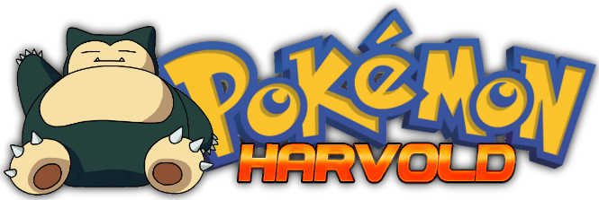

<a id="readme-top"></a>


<br />
<div align="center">
  <a href="https://harvold-fa155374a9eb.herokuapp.com/">
    
  </a>
  <p align="center">
    A web-based multiplayer Pokémon game.
    <br />
    <a href="https://harvold-fa155374a9eb.herokuapp.com/">Play Now</a>
    &middot;
    <a href="https://github.com/YidiWuCE21/harvold/issues/new">Report Bug</a>
  </p>
</div>

<!-- TABLE OF CONTENTS -->
<details>
  <summary>Table of Contents</summary>
  <ol>
    <li>
      <a href="#about-the-project">About The Project</a>
      <ul>
        <li><a href="#built-with">Built With</a></li>
      </ul>
    </li>
    <li><a href="#getting-started">Getting Started</a></li>
    <li><a href="#game-guide">Game Guide</a></li>
    <li><a href="#roadmap">Roadmap</a></li>
  </ol>
</details>

<!-- ABOUT THE PROJECT -->
## About The Project


The motivation behind Pokémon Harvold is twofold; the first is to improve as a developer by deepening my understanding of certain frameworks and tools. The second is because creating a Pokémon has been a personal goal of mine ever since my favourite browser-based game, Pokémon Omega, was nuked from orbit by Nintendo in 2014.

The game generally uses Gen VI as a guideline for battle mechanics, although some mechanics like Mega Evolution are deliberately not supported. Pokémon past Gen V are not obtainable for nostalgia reasons. The battle engine was written from scratch with game data being pulled from PokéAPI, so some mechanics (e.g. terrain, certain abilities) are not yet implemented.

<p align="right">(<a href="#readme-top">back to top</a>)</p>

### Built With

* [Django](https://www.djangoproject.com/)
* [React](https://react.dev/)
* [PostgreSQL](https://www.postgresql.org/)

<p align="right">(<a href="#readme-top">back to top</a>)</p>

<!-- GETTING STARTED -->
## Getting Started

You can play the live game here. You can also play the game locally in DEBUG mode which creates an SQLite instance or by hooking it up to your own database. Just download the project. Install dependencies with pip.

  ```sh
  pip install -r requirements.txt
  ```
Set some environment variables: DEBUG should be True, and SECRET_KEY can be any arbitrary value. Then run it.

  ```sh
  python manage.py runserver
  ```

## Game Guide

The generic gameplay loop is not much different from standard Pokémon games; you explore maps, catch ~~Pokémon~~ Pals, and level them up. The Pokécenter can be used for healing in between battles. Trainers on routes can be fought for money, which can be used to purchase supplies and useful items at the Pokémart. Excess Pokémon are stored in your Box, and can be swapped into your party between battles. Items are stored in the bag, including TMs, HMs, and held items. Held items can be given to Pokémon on your Bag page, and can be taken back on their detaield info pages.

The game is not as railroaded as the handheld games in that there is no explicit story that limits map progression. Some regions, however, are gated behind certain HMs, which can be obtained from beating Gym Leaders.

The current "end-game" is the Battle Mansion, a Pokémon Omega inspired Battle Facility, where you challenge 5 floors of trainers to fight. This activity can award rare TMs and evolution items unobtainable in the shop.

<p align="right">(<a href="#readme-top">back to top</a>)</p>


<!-- ROADMAP -->
## Roadmap

- [x] Swarm Pokémon
- [x] Battle Mansion
    - [x] Generic trainer generation
    - [x] Gauntlet template
- [ ] More map trainers and roaming Pokémon
- [ ] Settings and tutorial
- [ ] Trading feature
- [ ] All moves/abilities implemented
- [ ] Day/night cycle
- [ ] Item improvements
    - [ ] EV reducing berries
    - [ ] Separate in battle medicine from supplements
    - [ ] Better held item management
- [ ] Additional box functionality
    - [ ] Mass release
    - [ ] Tagging and filtering
    - [ ] Custom right click menu
- [ ] Mecha Tyranitar raid
- [ ] Live PVP
- [ ] Roguelike battle facility
- [ ] Procedurally generated dungeon

<p align="right">(<a href="#readme-top">back to top</a>)</p>


## Acknowledgments

Credits for sprites/artwork can be found on the game page.
